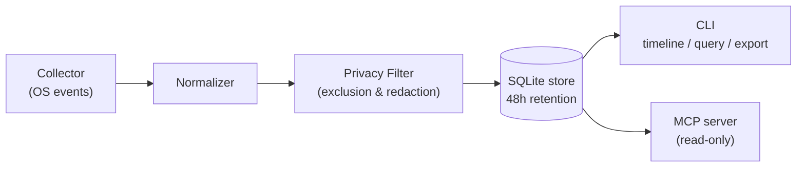

**Zanei** (残映, *zan-ei*) records what you are doing on your computer — from OS-level events, not screen recordings — and lets you retrieve it in a form AI agents can read directly.

:::note[Platform support]
Zanei currently runs on **macOS only** (Apple Silicon and Intel). Windows and Linux are on the roadmap.
:::

```bash
zanei timeline --since 2h
```

That single command returns the last two hours of your activity as a session-structured, deduplicated Markdown timeline. Coding agents like Claude Code or Codex CLI can read it to understand what you were just working on.

## What you can do with it

<CardGroup cols={2}>
  <Card title="Resume work" icon="history">
    "Pick up where I left off" just works. Your agent reconstructs the context — the PR you were reviewing, the files you were editing, the pages you were reading — from the timeline.
  </Card>
  <Card title="Search your activity" icon="search">
    "Which Stripe doc was I reading yesterday?" Query raw events filtered by time range, app, or event type.
  </Card>
  <Card title="Standups and work logs" icon="clipboard-list">
    Feed a day's timeline to your agent and get a draft of your daily report in seconds.
  </Card>
  <Card title="Context for agents" icon="bot">
    Two integration surfaces — CLI and MCP — plus shipped skill files cover major agents, including shell-less MCP clients like Claude Desktop.
  </Card>
</CardGroup>

## Design principles

Activity history is sensitive data, so the defaults are conservative:

| Principle | Implementation |
| --- | --- |
| **Local-only** | There is no network path for sending your data anywhere. |
| **No screen recording** | No screenshots, no screen-capture APIs. Only OS accessibility and event information. |
| **No keystroke content by default** | Only the fact that typing happened and the field type are recorded. Capturing content is an explicit opt-in. |
| **Sensitive data excluded** | Password fields, Chrome Incognito URLs, and password managers are excluded by default. |
| **Short-lived retention** | Events are deleted automatically after 48 hours by default. |

See the [privacy model](/guides/privacy) for details.

## How it works



Zanei captures OS events — app switches, window focus, UI interactions, browser URL changes — normalizes them, applies privacy processing, and writes them to a **local SQLite store**. Everything that reads data back (CLI, MCP) is a thin wrapper over the same store.

## Two interfaces

| Interface | Role |
| --- | --- |
| [CLI](/reference/cli) | The core surface. Recording control, permission diagnostics, timeline retrieval, and filter management — all in a single `zanei` binary. |
| [MCP server](/reference/mcp) | A read-only view over the same store. The only path for shell-less MCP clients such as Claude Desktop. |

For agents, [`zanei setup`](/agents/setup) also provides a skill: instructions telling the agent when to call Zanei. It installs the skill for agents with native support and prints derived instructions for other CLI agents. MCP tools carry their own descriptions inside the protocol.

## Platform support

- **macOS**, currently. Release binaries are signed and notarized, with no external runtime dependencies. Install with `brew install kentoshimizu/tap/zanei`.
- Browser URL capture currently supports **Google Chrome only**. See the [event reference](/reference/events) for the reasoning and per-browser status.
- Windows and Linux are on the roadmap.

## Next steps

<CardGroup cols={2}>
  <Card title="Quickstart" href="/quickstart" icon="rocket">
    From install to your first timeline in five minutes.
  </Card>
  <Card title="Privacy model" href="/guides/privacy" icon="shield-check">
    What gets recorded, and what never does.
  </Card>
  <Card title="Agent integration" href="/agents" icon="bot">
    Connect Claude Code, Codex, opencode, Claude Desktop, and pi.
  </Card>
  <Card title="CLI reference" href="/reference/cli" icon="terminal">
    Every command, flag, and exit code.
  </Card>
</CardGroup>
