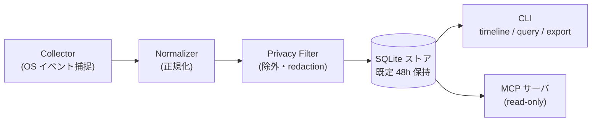

**Zanei**（残映）は、あなたが PC で「何をしていたか」を OS のイベントから時系列に記録し、AI agent がそのまま読める形で取り出せるようにするツールです。

:::note[対応プラットフォーム]
Zanei は現在 **macOS のみ**対応です（Apple Silicon / Intel）。
:::

```bash
zanei timeline --since 2h
```

これだけで、直近 2 時間の作業履歴がセッション単位に整理された Markdown タイムラインになります。Claude Code や Codex CLI のような coding agent は、これを読むことで「ユーザーがさっきまで何をしていたか」を把握できます。

## できること

<CardGroup cols={2}>
  <Card title="作業の再開" icon="history">
    「さっきの続きやって」で通じる。agent が中断前の文脈（見ていた PR・編集していたファイル・調べていたページ）をタイムラインから復元します。
  </Card>
  <Card title="行動の検索" icon="search">
    「昨日見てた Stripe のドキュメントどれだっけ」。生イベントを期間・アプリ・イベント型で絞って取り出せます。
  </Card>
  <Card title="日報・スタンドアップ" icon="clipboard-list">
    1 日分のタイムラインを agent に要約させれば、作業ログの下書きが数秒でできます。
  </Card>
  <Card title="agent に文脈を渡す" icon="bot">
    CLI と MCP の 2 つの経路と同梱の skill で主要 agent につながります。シェルを持たない Claude Desktop などの MCP クライアントからも使えます。
  </Card>
</CardGroup>

## 設計原則

PC 操作履歴は機微なデータなので、既定値は保守的にしています。

| 原則 | 実装 |
| --- | --- |
| **ローカル完結・保存時に暗号化** | データを外部に送る経路がありません。ストアファイルは暗号化され、鍵はログインキーチェーンに留まります。 |
| **画面録画なし** | スクリーンショットも画面収録 API も使いません。OS のアクセシビリティ／イベント情報のみを扱います。 |
| **キー入力の内容は既定で記録しない** | 記録するのは「入力があった事実とフィールド種別」まで。内容の記録は明示的な opt-in です。 |
| **機微データの除外** | パスワード欄・Chrome シークレットウィンドウの URL・パスワードマネージャ等を既定で除外します。 |
| **短期保持** | 記録は既定 48 時間で自動削除されます。 |

詳細は[プライバシーモデル](/ja/guides/privacy)を参照してください。

## 仕組み



アプリ切替・ウィンドウフォーカス・UI 操作・ブラウザの URL 変化などの OS イベントを捕捉し、正規化とプライバシー処理を経て**ローカルの SQLite ストア**に書き込みます。読み出し系（CLI・MCP）はすべて同じストアを見る薄いラッパーです。

## 2 つのインターフェース

| インターフェース | 役割 |
| --- | --- |
| [CLI](/ja/reference/cli) | 操作の中核。記録の開始・停止、権限診断、タイムライン取得、フィルタ管理まですべて単一バイナリ `zanei` で行います。 |
| [MCP サーバ](/ja/reference/mcp) | 同じストアへの read-only ビュー。シェルを持たない MCP クライアント（Claude Desktop 等）にとっては唯一の経路です。 |

agent 向けには、[`zanei setup`](/ja/agents/setup) が skill（いつ Zanei を呼ぶかを agent に伝える指示）も提供します。skill 対応 agent には配置し、その他の CLI agent には導出した指示を表示します。MCP のツールは説明をプロトコル内に持っています。

## 対応環境

- **macOS**（現在）。リリースバイナリは署名・notarize 済みで、外部ランタイム依存はありません。`brew install kentoshimizu/tap/zanei` でインストールできます。
- ブラウザ URL の記録は **Google Chrome のみ**（現在）。理由と各ブラウザの扱いは[イベントリファレンス](/ja/reference/events)を参照してください。
- Windows / Linux はロードマップ上の将来対応です。

## 次のステップ

<CardGroup cols={2}>
  <Card title="クイックスタート" href="/ja/quickstart" icon="rocket">
    インストールから最初のタイムライン取得まで 5 分。
  </Card>
  <Card title="プライバシーモデル" href="/ja/guides/privacy" icon="shield-check">
    何が記録され、何が記録されないのか。
  </Card>
  <Card title="Agent 連携" href="/ja/agents" icon="bot">
    Claude Code / Codex / opencode / Claude Desktop / pi との接続。
  </Card>
  <Card title="CLI リファレンス" href="/ja/reference/cli" icon="terminal">
    全コマンド・フラグ・終了コード。
  </Card>
</CardGroup>
